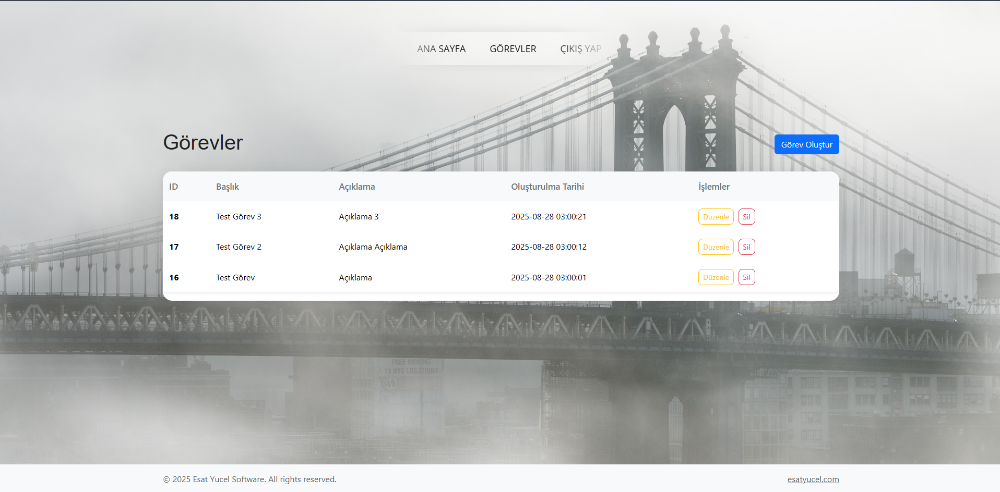
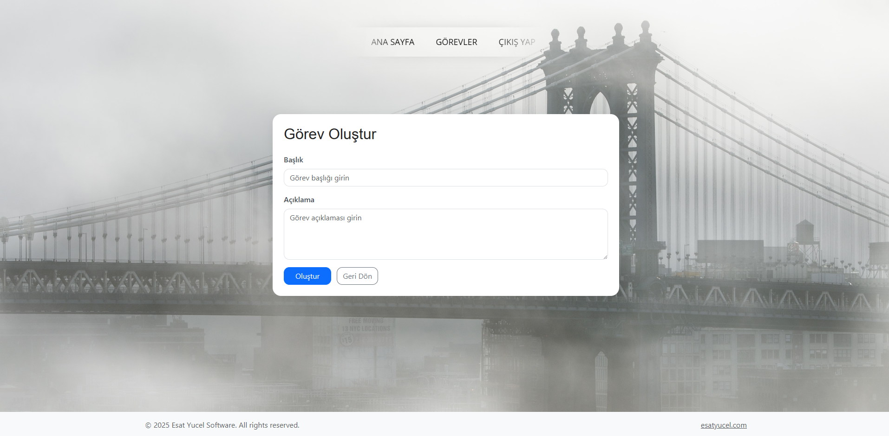

# 📌 Kişisel Görev Yönetimi (Task Manager) Projesi

Bu proje **PHP, MVC ve OOP prensipleri** kullanılarak geliştirilmiş bir **Kişisel Görev Yönetimi Uygulaması**dır.
Her kullanıcı kendi görevlerini ekleyebilir, güncelleyebilir, silebilir ve listeleyebilir.

> Modern web geliştirme teknikleri ile tasarlandı ve responsive bir arayüz sunuyor.
> MVC yapısı sayesinde kodlar temiz, anlaşılır ve genişletilebilir.

---

## ✨ Özellikler

* Kullanıcı girişi ve kayıt sistemi
* Görev ekleme, düzenleme ve silme
* Kullanıcıya özel görev yönetimi
* Güvenli şifreleme (password\_hash)
* Responsive tasarım (mobil ve desktop uyumlu)
* MVC ve OOP prensiplerine uygun yapı

---

## 📸 Ekran Görüntüleri

### Giriş Ekranı

### Kayıt Ekranı

### Görev Listesi

### Görev Ekleme

### Görev Güncelleme

---

## 💻 Teknolojiler

* PHP 8+
* MySQL / MariaDB
* PDO
* HTML5 / CSS3 / Bootstrap 5
* MVC & OOP

---

## 🌐 Sosyal ve Destek

* Instagram: [@esatyucelsoftware](https://www.instagram.com/esatyucelsoftware)
* Web Sitesi: [https://esatyucel.com](https://esatyucel.com)

> Her türlü soru ve destek için iletişime geçebilirsiniz.

---

## 📝 Not

Bu proje tamamen **MVC ve OOP prensiplerine uygun** şekilde geliştirilmiştir.
Frontend ve backend ayrımı net, kod okunabilir ve kolay genişletilebilir şekilde tasarlanmıştır.
